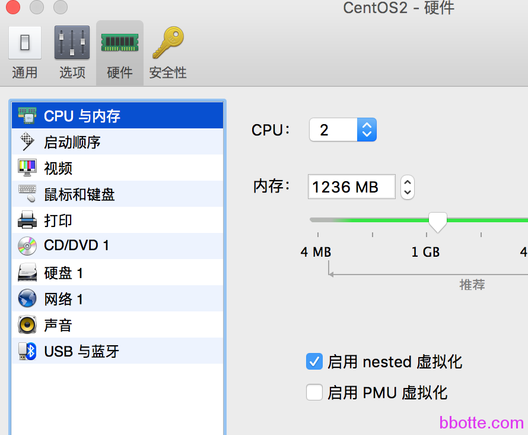

# vagrant虚拟机运行

1. vagrant说明
2. 安装vagrant
3. 配置vagrant
4. 启动vagrant
5. 登录虚拟主机
6. 其他配置
7. 多虚拟主机配置

### vagrant说明

vagrant是一个常用的虚拟机或者说是虚拟机组件，其他虚拟机还有KVM，Xen，VMware，VirtualBox，Parallels，Wine，docker等，在我理解vagrant定位于VMware和docker之间，他不提供全套的虚拟机，而利用虚拟机提供的接口对其进行操作。了解此虚拟机是通过consul文档

<https://www.vagrantup.com/> vagrant官网，下载最新的vagrant程序 vagrant_1.8.6_x86_64.rpm
<http://www.vagrantbox.es/> 下载box，即下载已安装系统的虚拟机镜像，此文章为vagrant-centos-6.7.box
<http://download.virtualbox.org/virtualbox/rpm/rhel/6/x86_64/> 下载对应的virtualbox版本，需要和内核版本对应，此文章为VirtualBox-5.1-5.1.6_110634_el6-1.x86_64.rpm

### **安装vagrant**

```
[root@vm01 ~]# cat /etc/centos-release
CentOS release 6.7 (Final)
[root@vm01 ~]# uname -a
Linux vm01 2.6.32-573.el6.x86_64 #1 SMP Thu Jul 23 15:44:03 UTC 2015 x86_64 x86_64 x86_64 GNU/Linux
# yum install libXmu
# rpm -ivh VirtualBox-5.1-5.1.6_110634_el6-1.x86_64.rpm
warning: VirtualBox-5.1-5.1.6_110634_el6-1.x86_64.rpm: Header V4 DSA/SHA1 Signature, key ID 98ab5139: NOKEY
Preparing...                ########################################### [100%]
   1:VirtualBox-5.1         ########################################### [100%]
 
Creating group 'vboxusers'. VM users must be member of that group!
 
vboxdrv.sh: failed: Look at /var/log/vbox-install.log to find out what went wrong.
This system is not currently set up to build kernel modules (system extensions).
Running the following commands should set the system up correctly:
 
  yum install kernel-devel-2.6.32-573.el6.x86_64
(The last command may fail if your system is not fully updated.)
  yum install kernel-devel
 
There were problems setting up VirtualBox.  To re-start the set-up process, run
  /sbin/vboxconfig
as root.
vboxdrv.sh: failed: Look at /var/log/vbox-install.log to find out what went wrong.
[root@vm01 ~]# cat /var/log/vbox-install.log
Makefile:185: *** Error: unable to find the sources of your current Linux kernel. Specify KERN_DIR=<directory> and run Make again。 停止。
Makefile:185: *** Error: unable to find the sources of your current Linux kernel. Specify KERN_DIR=<directory> and run Make again.  Stop.
 
# yum install kernel-devel
# ls /usr/src/kernels/
2.6.32-642.6.1.el6.x86_64
# echo export KERN_DIR=/usr/src/kernels/2.6.32-642.6.1.el6.x86_64 >> ~/.bashrc
 
# rpm -ivh vagrant_1.8.6_x86_64.rpm
```

### **配置vagrant**

```
# vagrant box add centos67 vagrant-centos-6.7.box
==> box: Box file was not detected as metadata. Adding it directly...
==> box: Adding box 'centos67' (v0) for provider:
    box: Unpacking necessary files from: file:///root/vagrant-centos-6.7.box
==> box: Successfully added box 'centos67' (v0) for 'virtualbox'!
[root@vm01 ~]# vagrant init centos67
A `Vagrantfile` has been placed in this directory. You are now
ready to `vagrant up` your first virtual environment! Please read
the comments in the Vagrantfile as well as documentation on
`vagrantup.com` for more information on using Vagrant.
[root@vm01 ~]# vagrant box list
centos67 (virtualbox, 0)
[root@vm01 ~]# vim Vagrantfile
[root@vm01 ~]# egrep -v "^.*#|^$" Vagrantfile
Vagrant.configure("2") do |config|
  config.vm.box = "centos67"
  config.vm.network "public_network"
   config.vm.provider "virtualbox" do |vb|
     vb.gui = false
     vb.memory = "512"
   end
end
```

### **启动vagrant**

```
[root@vm01 ~]# vagrant up
VirtualBox is complaining that the kernel module is not loaded. Please
run `VBoxManage --version` or open the VirtualBox GUI to see the error
message which should contain instructions on how to fix this error.
 
[root@vm01 ~]# /sbin/vboxconfig
vboxdrv.sh: Building VirtualBox kernel modules.
vboxdrv.sh: Starting VirtualBox services.
vboxdrv.sh: Starting VirtualBox services.
[root@vm01 ~]# VBoxManage list vms
[root@vm01 ~]# vagrant up
Bringing machine 'default' up with 'virtualbox' provider...
==> default: Importing base box 'centos67'...
==> default: Matching MAC address for NAT networking...
==> default: Setting the name of the VM: root_default_1474564288098_64453
==> default: Clearing any previously set network interfaces...
==> default: Preparing network interfaces based on configuration...
    default: Adapter 1: nat
    default: Adapter 2: bridged
==> default: Forwarding ports...
    default: 22 (guest) => 2222 (host) (adapter 1)
==> default: Running 'pre-boot' VM customizations...
==> default: Booting VM...
There was an error while executing `VBoxManage`, a CLI used by Vagrant
for controlling VirtualBox. The command and stderr is shown below.
 
Command: ["startvm", "47a76273-8dfd-47a4-b70f-1c0d012c70fe", "--type", "headless"]
 
Stderr: VBoxManage: error: VT-x is not available (VERR_VMX_NO_VMX)
VBoxManage: error: Details: code NS_ERROR_FAILURE (0x80004005), component ConsoleWrap, interface IConsole
```

parallels虚拟机开启虚拟化，VMware或者virtualbox也有开启的选项



```
[root@vm01 ~]# VBoxManage list vms
"root_default_1474564288098_64453" {47a76273-8dfd-47a4-b70f-1c0d012c70fe}
[root@vm01 ~]# VBoxManage modifyvm "root_default_1474564288098_64453" --hwvirtex off
[root@vm01 ~]# vagrant up
Bringing machine 'default' up with 'virtualbox' provider...
==> default: Clearing any previously set forwarded ports...
==> default: Clearing any previously set network interfaces...
==> default: Preparing network interfaces based on configuration...
    default: Adapter 1: nat
    default: Adapter 2: bridged
==> default: Forwarding ports...
    default: 22 (guest) => 2222 (host) (adapter 1)
==> default: Running 'pre-boot' VM customizations...
==> default: Booting VM...
==> default: Waiting for machine to boot. This may take a few minutes...
    default: SSH address: 127.0.0.1:2222
    default: SSH username: vagrant
    default: SSH auth method: private key
    default: Warning: Remote connection disconnect. Retrying...
    default:
    default: Vagrant insecure key detected. Vagrant will automatically replace
    default: this with a newly generated keypair for better security.
    default:
    default: Inserting generated public key within guest...
    default: Removing insecure key from the guest if it's present...
    default: Key inserted! Disconnecting and reconnecting using new SSH key...
==> default: Machine booted and ready!
==> default: Checking for guest additions in VM...
    default: The guest additions on this VM do not match the installed version of
    default: VirtualBox! In most cases this is fine, but in rare cases it can
    default: prevent things such as shared folders from working properly. If you see
    default: shared folder errors, please make sure the guest additions within the
    default: virtual machine match the version of VirtualBox you have installed on
    default: your host and reload your VM.
    default:
    default: Guest Additions Version: 4.3.30
    default: VirtualBox Version: 5.1
==> default: Configuring and enabling network interfaces...
==> default: Mounting shared folders...
    default: /vagrant => /root
[root@vm01 ~]# vagrant status
Current machine states:
 
default                   running (virtualbox)
```

这里有遇到一个问题，vagrant up后，虚拟机启动到出现这一行日志不往下走了
default: SSH auth method: private key
原因是运行虚拟机的内存设置较小，调大解决

### **登录虚拟主机**

```
[root@vm01 ~]# vagrant ssh
[vagrant@localhost ~]$ exit
logout
Connection to 127.0.0.1 closed.
[root@vm01 ~]# netstat -tnlp|grep VBox
tcp        0      0 127.0.0.1:2222              0.0.0.0:*                   LISTEN      2119/VBoxHeadless
[root@vm01 ~]# ssh -p2222 vagrant@127.0.0.1       #用户名密码都为vagrant
The authenticity of host '[127.0.0.1]:2222 ([127.0.0.1]:2222)' can't be established.
RSA key fingerprint is 5c:97:4b:96:a2:41:a8:44:cc:70:b1:5e:8d:a7:a5:3b.
Are you sure you want to continue connecting (yes/no)? yes
Warning: Permanently added '[127.0.0.1]:2222' (RSA) to the list of known hosts.
vagrant@127.0.0.1's password:
Last login: Thu Sep 22 18:19:56 2016 from 10.0.2.2
[vagrant@localhost ~]$ su
密码：
[root@localhost vagrant]# exit
exit
[vagrant@localhost ~]$ exit
logout
Connection to 127.0.0.1 closed.
```

### **其他配置**

```
[root@vm01 ~]# vagrant ssh-config
[root@vm01 ~]# vagrant plugin install vagrant-hostmanager
[root@vm01 ~]# vagrant plugin list
[root@vm01 ~]# vagrant -h   查看
```

### **多虚拟主机配置**

```
[root@vm01 ~]# egrep -v "^.*#|^$" Vagrantfile
Vagrant.configure("2") do |config|
  config.vm.box = "centos67"
  config.vm.define :web do |web|
    web.vm.provider "virtualbox" do |v|
          v.customize ["modifyvm", :id, "--name", "web", "--memory", "512"]
    end
    web.vm.box = "centos67"
    web.vm.hostname = "web"
    web.vm.network :private_network, ip: "192.168.100.2"
  end
  config.vm.define :db do |db|
    db.vm.provider "virtualbox" do |v|
          v.customize ["modifyvm", :id, "--name", "db", "--memory", "512"]
    end
    db.vm.box = "centos67"
    db.vm.hostname = "db"
    db.vm.network :private_network, ip: "192.168.100.3"
  end
  config.vm.network "public_network"
end
 
 
[root@vm01 ~]# vagrant up
Bringing machine 'web' up with 'virtualbox' provider...
Bringing machine 'db' up with 'virtualbox' provider...
==> web: Clearing any previously set forwarded ports...
==> web: Fixed port collision for 22 => 2222. Now on port 2200.
==> web: Clearing any previously set network interfaces...
==> web: Preparing network interfaces based on configuration...
    web: Adapter 1: nat
    web: Adapter 2: bridged
    web: Adapter 3: hostonly
==> web: Forwarding ports...
    web: 22 (guest) => 2200 (host) (adapter 1)
==> web: Running 'pre-boot' VM customizations...
==> web: Booting VM...
==> web: Waiting for machine to boot. This may take a few minutes...
    web: SSH address: 127.0.0.1:2200
    web: SSH username: vagrant
    web: SSH auth method: private key
    web: Warning: Remote connection disconnect. Retrying...
==> web: Machine booted and ready!
==> web: Checking for guest additions in VM...
    web: The guest additions on this VM do not match the installed version of
    web: VirtualBox! In most cases this is fine, but in rare cases it can
    web: prevent things such as shared folders from working properly. If you see
    web: shared folder errors, please make sure the guest additions within the
    web: virtual machine match the version of VirtualBox you have installed on
    web: your host and reload your VM.
    web:
    web: Guest Additions Version: 4.3.30
    web: VirtualBox Version: 5.1
==> web: Setting hostname...
==> web: Configuring and enabling network interfaces...
==> web: Mounting shared folders...
    web: /vagrant => /root
==> web: Machine already provisioned. Run `vagrant provision` or use the `--provision`
==> web: flag to force provisioning. Provisioners marked to run always will still run.
...
 
 
[root@vm01 ~]# ls VirtualBox\ VMs/   #虚拟机实际的文件夹路径
db  web
 
[root@vm01 ~]# VBoxManage -h
```

制作自己的box

<https://github.com/CommanderK5/packer-centos-template>

vagrant虚拟机还是很轻便的，比VMware轻，比docker重

2016年10月19日 于 [linux工匠](http://www.bbotte.com/) 发表