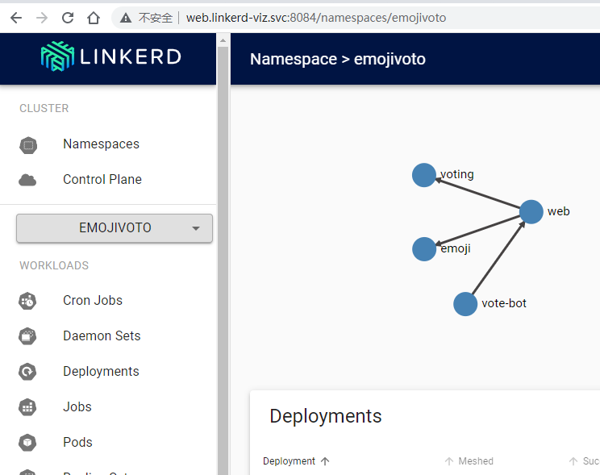
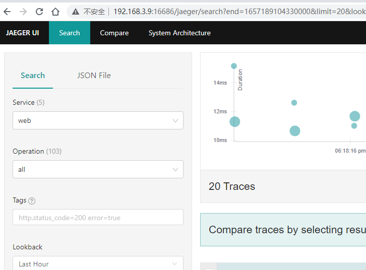

# 服务网格Linkerd安装初试

linkerd性能比istio要高许多，所以再测一下linkerd服务，[kubernetes和istio开箱测试](https://bbotte.github.io/virtualization/kubernetes_and_istio_config_beginning)

**版本信息**
此linkerd版本为stable-2.11.3
k8s版本为 1.22.2

查看当前k8s版本信息

```
[root@k8s-master01 ~]# kubectl version --short
Client Version: v1.22.2
Server Version: v1.22.2
```


**安装linkerd2**
下载linkerd2-cli客户端

```
wget https://github.com/linkerd/linkerd2/releases/download/stable-2.11.3/linkerd2-cli-stable-2.11.3-linux-amd64
cp linkerd2-cli-stable-2.11.3-linux-amd64 /usr/bin/linkerd
chmod +x /usr/bin/linkerd
```

预检信息，不通过的话需要按提示更改，下面是已经通过了

```
# linkerd check --pre
Linkerd core checks
===================

kubernetes-api
--------------
√ can initialize the client
√ can query the Kubernetes API

kubernetes-version
------------------
√ is running the minimum Kubernetes API version
√ is running the minimum kubectl version

pre-kubernetes-setup
--------------------
√ control plane namespace does not already exist
√ can create non-namespaced resources
√ can create ServiceAccounts
√ can create Services
√ can create Deployments
√ can create CronJobs
√ can create ConfigMaps
√ can create Secrets
√ can read Secrets
√ can read extension-apiserver-authentication configmap
√ no clock skew detected

linkerd-version
---------------
‼ can determine the latest version
    Get "https://versioncheck.linkerd.io/version.json?version=stable-2.11.3&uuid=unknown&source=cli": context deadline exceeded
    see https://linkerd.io/2.11/checks/#l5d-version-latest for hints
‼ cli is up-to-date
    unsupported version channel: stable-2.11.3
    see https://linkerd.io/2.11/checks/#l5d-version-cli for hints

Status check results are √
```

**在k8s中安装linkerd**

在k8s中安装linkerd，不过有提示，安装不成功

```
# linkerd install | kubectl apply -f -
there are nodes using the docker container runtime and proxy-init container must run as root user.
try installing linkerd via --set proxyInit.runAsRoot=true
error: no objects passed to apply
```

按提示操作，加上 --set proxyInit.runAsRoot=true 参数

```
# linkerd install --set proxyInit.runAsRoot=true| kubectl apply -f -
namespace/linkerd created
clusterrole.rbac.authorization.k8s.io/linkerd-linkerd-identity created
clusterrolebinding.rbac.authorization.k8s.io/linkerd-linkerd-identity created
serviceaccount/linkerd-identity created
clusterrole.rbac.authorization.k8s.io/linkerd-linkerd-destination created
clusterrolebinding.rbac.authorization.k8s.io/linkerd-linkerd-destination created
serviceaccount/linkerd-destination created
secret/linkerd-sp-validator-k8s-tls created
validatingwebhookconfiguration.admissionregistration.k8s.io/linkerd-sp-validator-webhook-config created
secret/linkerd-policy-validator-k8s-tls created
validatingwebhookconfiguration.admissionregistration.k8s.io/linkerd-policy-validator-webhook-config created
clusterrole.rbac.authorization.k8s.io/linkerd-policy created
clusterrolebinding.rbac.authorization.k8s.io/linkerd-destination-policy created
role.rbac.authorization.k8s.io/linkerd-heartbeat created
rolebinding.rbac.authorization.k8s.io/linkerd-heartbeat created
clusterrole.rbac.authorization.k8s.io/linkerd-heartbeat created
clusterrolebinding.rbac.authorization.k8s.io/linkerd-heartbeat created
serviceaccount/linkerd-heartbeat created
customresourcedefinition.apiextensions.k8s.io/servers.policy.linkerd.io created
customresourcedefinition.apiextensions.k8s.io/serverauthorizations.policy.linkerd.io created
customresourcedefinition.apiextensions.k8s.io/serviceprofiles.linkerd.io created
customresourcedefinition.apiextensions.k8s.io/trafficsplits.split.smi-spec.io created
clusterrole.rbac.authorization.k8s.io/linkerd-linkerd-proxy-injector created
clusterrolebinding.rbac.authorization.k8s.io/linkerd-linkerd-proxy-injector created
serviceaccount/linkerd-proxy-injector created
secret/linkerd-proxy-injector-k8s-tls created
mutatingwebhookconfiguration.admissionregistration.k8s.io/linkerd-proxy-injector-webhook-config created
configmap/linkerd-config created
secret/linkerd-identity-issuer created
configmap/linkerd-identity-trust-roots created
service/linkerd-identity created
service/linkerd-identity-headless created
deployment.apps/linkerd-identity created
service/linkerd-dst created
service/linkerd-dst-headless created
service/linkerd-sp-validator created
service/linkerd-policy created
service/linkerd-policy-validator created
deployment.apps/linkerd-destination created
Warning: batch/v1beta1 CronJob is deprecated in v1.21+, unavailable in v1.25+; use batch/v1 CronJob
cronjob.batch/linkerd-heartbeat created
deployment.apps/linkerd-proxy-injector created
service/linkerd-proxy-injector created
secret/linkerd-config-overrides created

```

查看已安装的linkerd状态

```
# kubectl get ns
NAME              STATUS   AGE
default           Active   137d
kube-node-lease   Active   137d
kube-public       Active   137d
kube-system       Active   137d
linkerd           Active   11m

# kubectl get all -n linkerd
NAME                                          READY   STATUS    RESTARTS        AGE
pod/linkerd-destination-7fbdb58d59-nw5w2      4/4     Running   0               11m
pod/linkerd-identity-6d9446f8f8-mpwnb         2/2     Running   0               11m
pod/linkerd-proxy-injector-785799d676-x2wpv   2/2     Running   1 (9m43s ago)   11m

NAME                                TYPE        CLUSTER-IP     EXTERNAL-IP   PORT(S)    AGE
service/linkerd-dst                 ClusterIP   10.96.18.242   <none>        8086/TCP   11m
service/linkerd-dst-headless        ClusterIP   None           <none>        8086/TCP   11m
service/linkerd-identity            ClusterIP   10.96.0.113    <none>        8080/TCP   11m
service/linkerd-identity-headless   ClusterIP   None           <none>        8080/TCP   11m
service/linkerd-policy              ClusterIP   None           <none>        8090/TCP   11m
service/linkerd-policy-validator    ClusterIP   10.96.28.241   <none>        443/TCP    11m
service/linkerd-proxy-injector      ClusterIP   10.96.20.208   <none>        443/TCP    11m
service/linkerd-sp-validator        ClusterIP   10.96.20.120   <none>        443/TCP    11m

NAME                                     READY   UP-TO-DATE   AVAILABLE   AGE
deployment.apps/linkerd-destination      1/1     1            1           11m
deployment.apps/linkerd-identity         1/1     1            1           11m
deployment.apps/linkerd-proxy-injector   1/1     1            1           11m

NAME                                                DESIRED   CURRENT   READY   AGE
replicaset.apps/linkerd-destination-7fbdb58d59      1         1         1       11m
replicaset.apps/linkerd-identity-6d9446f8f8         1         1         1       11m
replicaset.apps/linkerd-proxy-injector-785799d676   1         1         1       11m

NAME                              SCHEDULE      SUSPEND   ACTIVE   LAST SCHEDULE   AGE
cronjob.batch/linkerd-heartbeat   25 02 * * *   False     0        2m16s           11m
```

linked已经安装完成，下面用实例测试

**对pod进行注入**

官方示例，先建立deployment，生成pod

```
curl --proto '=https' --tlsv1.2 -sSfL https://run.linkerd.io/emojivoto.yml >  emojivoto.yml
kubectl apply -f emojivoto.yml

# kubectl get po -n emojivoto
NAME                        READY   STATUS    RESTARTS   AGE
emoji-66ccdb4d86-6hld5      1/1     Running   0          72s
vote-bot-69754c864f-h8dms   1/1     Running   0          72s
voting-f999bd4d7-gtbfm      1/1     Running   0          72s
web-79469b946f-zw84f        1/1     Running   0          72s
# kubectl -n emojivoto port-forward svc/web-svc --address='0.0.0.0' 8080:80
Forwarding from 0.0.0.0:8080 -> 8080
Handling connection for 8080

```

浏览器访问这个节点的ip:8080打开emoji图标页面，说明测试是deploy已经完成

下面对这个namespace做网格（mesh），或者说是注入,和istio一样的操作方法

```
kubectl get -n emojivoto deploy -o yaml | linkerd inject - | kubectl apply -f -
```

linkerd控制平面已经对这个namespace完成，可以检查一下现在的情况
```
# linkerd -n emojivoto check --proxy

```
**linkerd dashboard**

istio有dashboard面板，可以看到流量的情况，在linkerd中安装viz 插件也可以,是dashboard面板，可以显示metric  
```
# linkerd viz install | kubectl apply -f -

# kubectl get po -n linkerd-viz
NAME                           READY   STATUS    RESTARTS   AGE
grafana-d6b65ffb6-h7gmn        2/2     Running   0          77s
metrics-api-555fcbcc68-hql28   2/2     Running   0          77s
prometheus-76d4474888-z2f6x    1/2     Running   0          77s
tap-858c6f77b7-jnprh           2/2     Running   0          77s
tap-injector-b86645f7f-bvm8m   2/2     Running   0          75s
web-76b9d5c8d9-b9dgw           2/2     Running   0          75s

```

访问dashboard的话，简单的方法来做如下，就是把viz的web 通过proxy代理出来，本地的8084端口映射到 linkerd-viz命名空间的service/web 8084端口

```
kubectl port-forward --address='0.0.0.0' -n linkerd-viz service/web 8084:8084
```
浏览器绑定hosts ，这里 192.168.3.9 是node-master1的ip
192.168.3.9 web.linkerd-viz.svc
在浏览器访问 http://web.linkerd-viz.svc:8084/ 就打开了viz dashboard
因为 [暴露viz监控面板](https://linkerd.io/2.10/tasks/exposing-dashboard/#dns-rebinding-protection) 有写，为防止 DNS-rebinding 攻击， 仪表板拒绝任何 Host header 不是 localhost、127.0.0.1或 服务名称不是 web.linkerd-viz.svc 的请求,所以简单来说，用web.linkerd-viz.svc作为web的访问域名

否则会遇到linkerd viz dashboard访问浏览器有报错，
```
It appears that you are trying to reach this service with a host of '192.168.3.9:50750'.
This does not match /^(localhost|127\.0\.0\.1|web\.linkerd-viz\.svc\.cluster\.local|web\.linkerd-viz\.svc|\[::1\])(:\d+)?$/ and has been denied for security reasons.
Please see https://linkerd.io/dns-rebinding for an explanation of what is happening and how to fix it.
```


**安装jaeger插件**

安装jaeger插件

```
# linkerd jaeger install | kubectl apply -f -
# kubectl -n emojivoto set env --all deploy OC_AGENT_HOST=collector.linkerd-jaeger:55678

# linkerd jaeger dashboard --address='0.0.0.0'
Jaeger extension dashboard available at:
http://0.0.0.0:16686
Failed to open dashboard automatically
Visit http://0.0.0.0:16686 in your browser to view the dashboard
```

浏览器访问http://IP:16686/


参考 https://linkerd.io/2.11/getting-started/#step-2-validate-your-kubernetes-cluster 