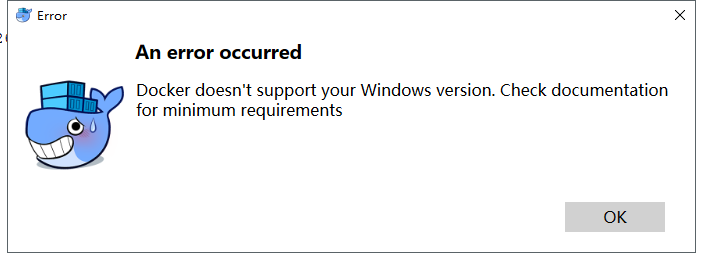
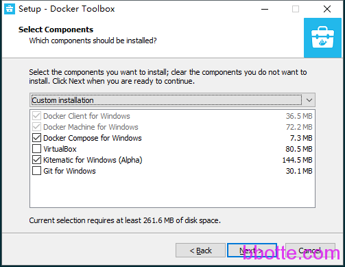
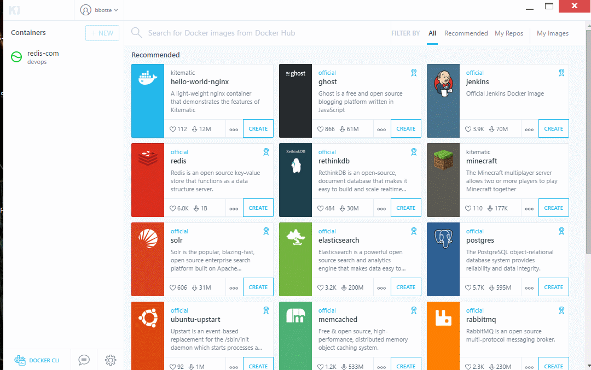

# windows主机中docker服务的运行

尽管这个docker服务用起来方便，只是在生产环境中遇到一个大的麻烦，virtualbox CPU飙升（72核256G Windows 2012）

在Windows上安装docker服务，docker提供了2个安装程序
[Docker for Windows Installer.exe](https://download.docker.com/win/stable/Docker%20for%20Windows%20Installer.exe)
[DockerToolbox.exe](https://download.docker.com/win/stable/DockerToolbox.exe)
有可能安装不成功，主要是Windows版本和docker版本对应问题，如果系统版本小于1607_14393，那么就安装DockerToolbox，新系统就安装Docker for Windows

```
安装 init,下面为必要条件:
    0.大于4g内存
    1.Windows10 64位Pro,Enterprise or Education (1607 Anniversary Update, Build 14393 or later)
    2.开启虚拟化
    3.安装VirtualBox
	4.Git Bash
如果1步骤中系统版本比较老:
    install DockerToolbox
否则:
    install Docker for Windows
```

tips:
查看本机系统版本：开始–运行–cmd–systeminfo

因本机版本为14393，安装时尚的Docker for Windows不成功，提示：
Docker doesn’t support your Windows version. Check documentation for minimum requirements



所以老老实实安装DockerToolbox，virtualbox和git电脑上有安装，所以就不重复安装了。如果没有的话把√都打上



安装后桌面生成2个图标
**Kitematic (Alpha)**                      docker容器图形化管理
**Docker Quickstart Terminal**     docker服务命令行

### 1,初始化DockerToolbox

执行Docker Quickstart Terminal，这个过程比较慢，因为要下载boot2docker.iso，度娘网盘
链接：https://pan.baidu.com/s/1dNK6FOV7w8vywow9OLgoWQ 提取码：l2cf ，放到下面目录
C:\Users\(你的Windows主机用户名)\.docker\machine\cache

初始化后进入命令行操作界面

```
root@DESKTOP-COFERNQ MINGW64 /c/Program Files/Docker Toolbox
$ ls
boot2docker.iso  docker-compose.exe*  docker-quickstart-terminal.ico  start.sh*     unins000.exe*
docker.exe*      docker-machine.exe*  kitematic/                      unins000.dat
```

### 2,把自建的私有仓库添加进去

```
$ docker-machine.exe ssh default
                        ##         .
                  ## ## ##        ==
               ## ## ## ## ##    ===
           /"""""""""""""""""\___/ ===
      ~~~ {~~ ~~~~ ~~~ ~~~~ ~~~ ~ /  ===- ~~~
           \______ o           __/
             \    \         __/
              \____\_______/
 _                 _   ____     _            _
| |__   ___   ___ | |_|___ \ __| | ___   ___| | _____ _ __
| '_ \ / _ \ / _ \| __| __) / _` |/ _ \ / __| |/ / _ \ '__|
| |_) | (_) | (_) | |_ / __/ (_| | (_) | (__|   <  __/ |
|_.__/ \___/ \___/ \__|_____\__,_|\___/ \___|_|\_\___|_|
Boot2Docker version 18.06.1-ce, build HEAD : c7e5c3e - Wed Aug 22 16:27:42 UTC 2018
Docker version 18.06.1-ce, build e68fc7a
docker@default:~$ sudo vi  /var/lib/boot2docker/profile
 
EXTRA_ARGS='
--label provider=virtualbox
--insecure-registry harbor.bbotte.com:5000
'
CACERT=/var/lib/boot2docker/ca.pem
DOCKER_HOST='-H tcp://0.0.0.0:2376'
DOCKER_STORAGE=aufs
DOCKER_TLS=auto
SERVERKEY=/var/lib/boot2docker/server-key.pem
SERVERCERT=/var/lib/boot2docker/server.pem
 
docker@default:~$ exit
$ docker-machine.exe restart default
$ docker login harbor.bbotte.com:5000 -u admin -p bbotte\!\@\%
```

这里面insert是粘贴

### 3,以docker-compose方式运行服务

```
$ cat docker-compose.yml
version: "3.3"
services:
  redis-com:
    container_name: redis-com
    image: harbor.bbotte.com:5000/devops/redis:v0.05
    restart: always
    volumes:
      - /c/Users/root/docker-compose/data:/data
    ports:
      - 6379:6379
    networks:
      - bbotte
    sysctls:
      net.core.somaxconn: 65535
    environment:
      DATADIR: "/data/redis"
 
networks:
  bbotte:
    external: false
```

上述docker-compose配置volumes根据自己电脑设置

```
$ docker-compose.exe up -d
Starting redis-com ... done
```

这样就会从仓库拉取镜像创建服务
本机可访问 192.168.99.100:6379

4,Kitematic查看或修改服务配置



在Kitematic管理后台可以exec到docker内部、查看pod日志、更改端口映射、磁盘映射等，也可创建在hub仓库<https://hub.docker.com/> 的镜像

docker-compose服务的更新可查看[docker-compose-publish](https://github.com/bbotte/bbotte.com/tree/master/docker-compose-publish)

关于Windows服务器下docker-compose磁盘挂载问题 DockerToolbox docker-compose volume

Docker Compose volume mounts don’t work with Docker Toolbox running on Windows

比如，要把D:/data映射到docker的 /opt 目录，那么首先需要把 data目录共享


然后在virtualbox中设置共享文件夹，名字为 d/data,如下图所示


再设置变量 COMPOSE_CONVERT_WINDOWS_PATHS=1，重启default虚拟机


这样，docker-compose文件中就可以直接使用了

volumes:
– /d/data:/opt

注意d/data前面有一个/。

如果不设置共享，那么默认的挂载目录必须是 C:\Users 文件夹下，因为default中有设置了

2018年11月06日 于 [linux工匠](https://bbotte.github.io/) 发表

