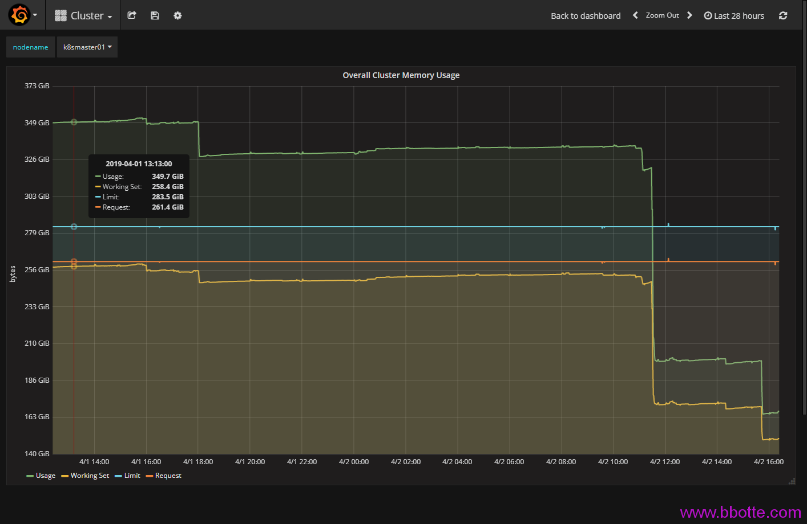
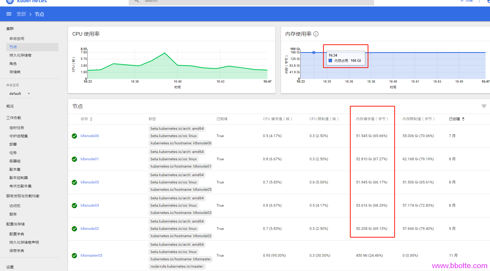
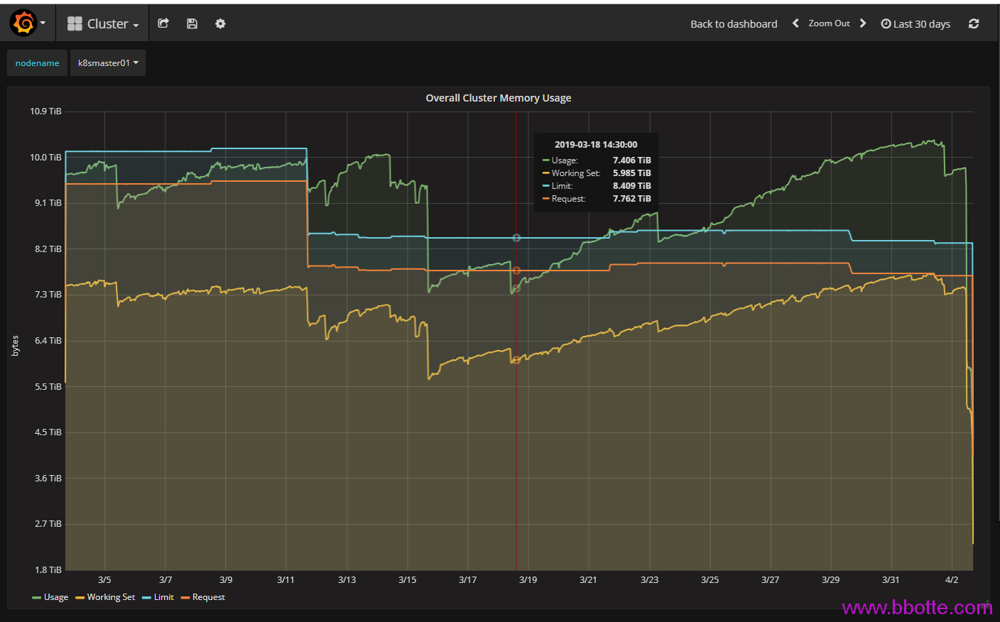

# kubernetes内存监控面板数值的意义


kubernetes内存监控面板数值的意义
grafana面板中Cluster的Overall Cluster Memory Usage值都和内存相关，有下面4个值
Usage,Working Set,Limit,Request
随着pod、service、deployment、replcat、StatefulSet的create、update、delete动作增长或下降。那么这些指标是监控什么的，哪些指标是pod真正使用，哪些是可以节省出来的内存，为什么Usage和Working Set差距那么大（超过90G内存），我的kubernetes集群到底需要多大内存才能保证正常运行？
先上几张图，如果都明白的话不用继续看下面文章

  

监控面板中内存减少一方面是资源删除，另一方面是gc，这个垃圾回收kubernetes官方文档解释是kubelet garbage-collection，而这2个操作经常是同步进行的，即资源删除后kubelet也会gc来回收内存。

1. kubelet Garbage Collection
2. 资源删除过程中的依赖处理
3. 资源监控值查看
4. Usage Working Set内存值降下来措施
5. 参考

### kubelet Garbage Collection

主要由两部分组成：
1.  containerGC: 使用指定的container回收策略，删除那些已经结束的containers。containerGC回收策略初始化是在cmd/kubelet/app/kubelet.go文件中CreateAndInitKubelet()接口中
2.  imageManager: k8s所有images生命周期管理就是通过imageManager来实现的，其实该imageManager也是依赖了cAdvisor。imageManager回收策略设置在cmd/kubelet/app/server.go中的UnsecuredKubeletConfig()接口

Kubernetes垃圾回收由kubelet进行管理，每分钟会查询清理一次容器，每五分钟查询清理一次镜像。在kubelet刚启动时并不会立即进行GC，即第一次进行容器回收为kubelet启动一分钟后，第一次进行镜像回收为kubelet启动五分钟后。
Kubernetes通过kubelet集成的cadvisor进行镜像的回收，有两个参数可以设置：–image-gc-high-threshold和–image-gc-low-threshold。当用于存储镜像的磁盘使用率达到百分之–image-gc-high-threshold时将触发镜像回收，删除最近最久未使用（LRU，Least Recently Used）的镜像直到磁盘使用率降为百分之–image-gc-low-threshold或无镜像可删为止。默认–image-gc-high-threshold为90，–image-gc-low-threshold为80。
容器回收有三个参数可设置：–minimum-container-ttl-duration，–maximum-dead-containers-per-container和–maximum-dead-containers。从容器停止运行时起经过–minimum-container-ttl-duration时间后，该容器标记为已过期将来可以被回收（只是标记，不是回收），默认值为1m0s。一般情况下每个pod最多可以保留–maximum-dead-containers-per-container个已停止运行的容器集，默认值为2。整个node节点可以保留–maximum-dead-containers个已停止运行的容器，默认值为100。

### 资源删除过程中的依赖处理

另外，怎么控制资源删除中的依赖关系也很重要。当删除对象时，可以指定是否该对象的 Dependent 也自动删除掉。自动删除 Dependent 也称为 级联删除 。 Kubernetes 中有两种 级联删除 的模式：
1.  background 模式
2.  foreground 模式

在 background 级联删除 模式下，Kubernetes 会立即删除 Owner 对象，然后垃圾收集器会在后台删除这些 Dependent。
在 foreground 级联删除 模式下，根对象首先进入 “删除中” 状态。在 “删除中” 状态会有如下的情况：
1.  对象仍然可以通过 REST API 可见。
2.  会设置对象的 deletionTimestamp 字段。

3.  对象的 metadata.finalizers 字段包含了值 “foregroundDeletion”。

一旦对象被设置为 “删除中” 状态，垃圾收集器会删除对象的所有 Dependent。 垃圾收集器在删除了所有 “Blocking” 状态的 Dependent（对象的 ownerReference.blockOwnerDeletion=true）之后，它会删除 Owner 对象。

在 “foreground 删除” 模式下，只有设置了 ownerReference.blockOwnerDeletion 值得 Dependent 才能阻止删除 Owner 对象。 在 Kubernetes 1.7 版本中将增加许可控制器（Admission Controller），基于 Owner 对象上的删除权限来控制用户去设置 blockOwnerDeletion 的值为 true，所以未授权的 Dependent 不能够延迟 Owner 对象的删除。

如果一个对象的 ownerReferences 字段被一个 Controller（例如 Deployment 或 ReplicaSet）设置，blockOwnerDeletion 会被自动设置，不需要手动修改这个字段。

### 资源监控值查看

回头来说Usage,Working Set,Limit,Request这四个监控值
Limit Request值可以这么查看：

```
kubectl get nodes --no-headers | awk '{print $1}' | xargs -I {} sh -c 'echo {}; kubectl describe node {} | grep Allocated -A 5 | grep -ve Event -ve Allocated -ve percent -ve -- ; echo'
 
kubectl get nodes --no-headers | awk '{print $1}'|while read i;do kubectl describe no $i;done
 
kubectl top pod -n kube-system
 
docker stats (动态查看资源情况)
```

Limit,Request值是创建服务时候自定义的，当然可以不定义，如果deployment只定义了limits，那么requests值等于limits。
为什么Limit,Request值这么大呢，因为没有加limits参数的话，在docker内部看到的内存是主机总内存量，k8s命名空间可以单独设置CPU和内存的limit，至少这样的监控指标看起来偏差不是太大
usage就是所用到最大内存量(比如一个pod设置limit为2g，实际上用了1g内存)，Working Set是pod实际运行的内存量。k8s集群最少需要使用多少内存，看Working Set就行

### Usage Working Set内存值降下来措施

1.  删除不用的kubernetes资源(service/deployment/pod等，kubelet GC)
2.  删除不用的docker images(kubelet GC)

```
docker images|sort -rn|grep harbor.bbotte.com|grep -v k8s|awk '{print $1,$2,$3}'|awk -F'-' 'gsub(/[[:blank:]]*/,"",$2){print $1,$2," ",$NF}'|awk '{print $2,$NF}'|awk 'x[$1]++' |awk '{print $2}'|while read i;do docker rmi $i;sleep 0.1;done
```

\3. 如果用traefik或ingress代理后端服务，后端服务已删除的情况下，在traefik或ingress配置中也删除(资源依赖)

### 参考

<https://k8smeetup.github.io/docs/concepts/cluster-administration/kubelet-garbage-collection/>
<https://kubernetes.io/zh/docs/concepts/workloads/controllers/garbage-collection/>
<https://www.cnblogs.com/openxxs/p/5275051.html>
<https://segmentfault.com/a/1190000008339064>
<https://kubernetes.io/zh/docs/concepts/configuration/manage-compute-resources-container/>

2019年04月03日 于 [linux工匠](http://www.bbotte.com/) 发表


