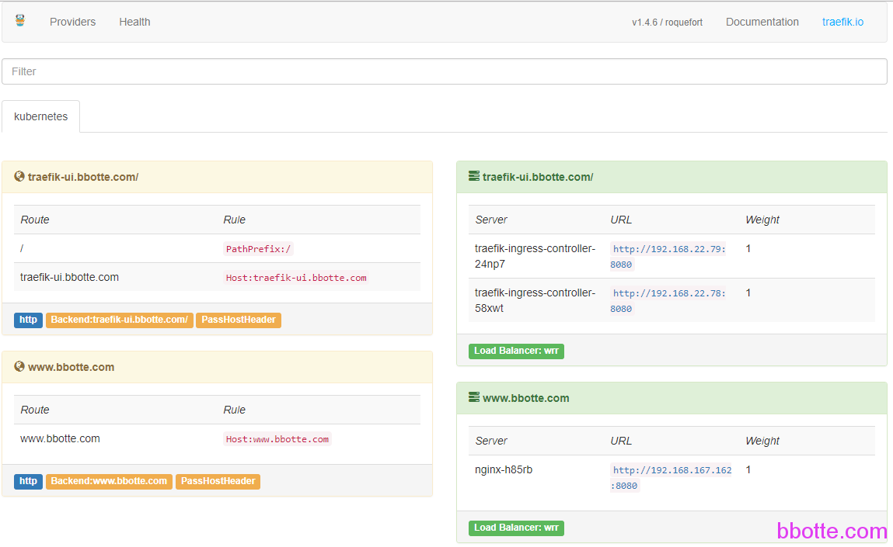

# linux工匠之kubernetes的traefik配置介绍

traefik <https://traefik.io/>同音于traffic，作为kubernetes服务官方反向代理，作用和ingress一样，支持Docker, Swarm mode, Kubernetes, Marathon, Consul, Etcd, Rancher, Amazon ECS等后端服务，可以说是一个神器

本traefik版本为 1.5.4

配置文件：

```
[root@master traefik]# ls
ingress-nginx.yaml  traefik-daemonset.yaml   traefik-rbac.yaml
nginx-service.yaml  traefik-deployment.yaml  traefik-ui.yaml
```

traefik-deployment.yaml是部署traefik的，traefik-daemonset.yaml就是以DaemonSet方式部署，也就是每个节点都部署一个traefik服务，这样前面加上一个所有节点的代理(比如nginx)，就可以通过域名直接访问kubernetes内部服务

nginx-service.yaml就是一个nginx服务，目的是通过一个域名访问kubernetes内部的这个nginx服务，参见[linux工匠之kubernetes的ingress-nginx配置介绍](http://bbotte.com/kvm-xen/ingress-nginx-configuration-for-kubernetes/)

ingress-nginx.yaml 因为traefik代替了ingress-nginx，所以客户端ingress还是需要的，下面的traefik-deployment.yaml不用，因为traefik-daemonset.yaml包含了traefik服务，

```
# vim traefik-deployment.yaml 
 
---
apiVersion: v1
kind: ServiceAccount
metadata:
  name: traefik-ingress-controller
  namespace: kube-system
---
kind: Deployment
apiVersion: extensions/v1beta1
metadata:
  name: traefik-ingress-controller
  namespace: kube-system
  labels:
    k8s-app: traefik-ingress-lb
spec:
  replicas: 1
  selector:
    matchLabels:
      k8s-app: traefik-ingress-lb
  template:
    metadata:
      labels:
        k8s-app: traefik-ingress-lb
        name: traefik-ingress-lb
    spec:
      serviceAccountName: traefik-ingress-controller
      terminationGracePeriodSeconds: 60
      containers:
      - image: traefik
        name: traefik-ingress-lb
        args:
        - --web
        - --kubernetes
---
kind: Service
apiVersion: v1
metadata:
  name: traefik-ingress-service
  namespace: kube-system
spec:
  selector:
    k8s-app: traefik-ingress-lb
  ports:
    - protocol: TCP
      port: 80
      name: web
    - protocol: TCP
      port: 8080
      name: admin
  type: NodePort
```

```
# vim traefik-daemonset.yaml 
 
---
apiVersion: v1
kind: ServiceAccount
metadata:
  name: traefik-ingress-controller
  namespace: kube-system
---
kind: DaemonSet
apiVersion: extensions/v1beta1
metadata:
  name: traefik-ingress-controller
  namespace: kube-system
  labels:
    k8s-app: traefik-ingress-lb
spec:
  template:
    metadata:
      labels:
        k8s-app: traefik-ingress-lb
        name: traefik-ingress-lb
    spec:
      serviceAccountName: traefik-ingress-controller
      terminationGracePeriodSeconds: 60
      hostNetwork: true
      containers:
      - image: traefik
        name: traefik-ingress-lb
        ports:
        - name: http
          containerPort: 80
          hostPort: 80
        - name: admin
          containerPort: 8080
        securityContext:
          privileged: true
        args:
        - --web
        - --kubernetes
---
kind: Service
apiVersion: v1
metadata:
  name: traefik-ingress-service
  namespace: kube-system
spec:
  selector:
    k8s-app: traefik-ingress-lb
  ports:
    - protocol: TCP
      port: 80
      name: web
    - protocol: TCP
      port: 8080
      name: admin
  type: NodePort
```

```
# vim traefik-rbac.yaml 
 
---
kind: ClusterRole
apiVersion: rbac.authorization.k8s.io/v1beta1
metadata:
  name: traefik-ingress-controller
rules:
  - apiGroups:
      - ""
    resources:
      - services
      - endpoints
      - secrets
    verbs:
      - get
      - list
      - watch
  - apiGroups:
      - extensions
    resources:
      - ingresses
    verbs:
      - get
      - list
      - watch
---
kind: ClusterRoleBinding
apiVersion: rbac.authorization.k8s.io/v1beta1
metadata:
  name: traefik-ingress-controller
roleRef:
  apiGroup: rbac.authorization.k8s.io
  kind: ClusterRole
  name: traefik-ingress-controller
subjects:
- kind: ServiceAccount
  name: traefik-ingress-controller
  namespace: kube-system
```

```
# vim traefik-ui.yaml 
 
---
apiVersion: v1
kind: Service
metadata:
  name: traefik-web-ui
  namespace: kube-system
spec:
  selector:
    k8s-app: traefik-ingress-lb
  ports:
  - name: web
    port: 80
    targetPort: 8080
---
apiVersion: extensions/v1beta1
kind: Ingress
metadata:
  name: traefik-web-ui
  namespace: kube-system
spec:
  rules:
  - host: traefik-ui.bbotte.com
    http:
      paths:
      - path: /
        backend:
          serviceName: traefik-web-ui
          servicePort: web
```

```
# vim ingress-nginx.yaml 
 
apiVersion: extensions/v1beta1
kind: Ingress
metadata:
  name: ingress-nginx
spec:
  rules:
  - host: www.bbotte.com
    http:
      paths:
      - backend:
          # This assumes http-svc exists and routes to healthy endpoints.
          serviceName: nginx
          servicePort: 80
```

```
# vim nginx-service.yaml 
 
apiVersion: v1
kind: ReplicationController
metadata:
  name: nginx
spec:
  replicas: 1
  template:
    metadata:
      labels:
        app: nginx
    spec:
      containers:
      - name: nginx
        image: bbotte/nginx:v0.1
        ports:
        - containerPort: 8080
---
apiVersion: v1
kind: Service
metadata:
  name: nginx
  labels:
    app: nginx
spec:
  #type: NodePort
  ports:
  - port: 80
    targetPort: 8080
    protocol: TCP
    name: http
  selector:
    app: nginx
```

部署：

```
[root@master traefik]# kubectl create -f traefik-daemonset.yaml 
serviceaccount "traefik-ingress-controller" created
daemonset "traefik-ingress-controller" created
service "traefik-ingress-service" created
[root@master traefik]# kubectl create -f traefik-rbac.yaml 
clusterrole "traefik-ingress-controller" created
clusterrolebinding "traefik-ingress-controller" created
[root@master traefik]# kubectl create -f traefik-ui.yaml 
service "traefik-web-ui" created
ingress "traefik-web-ui" created
[root@master traefik]# kubectl create -f ingress-nginx.yaml
[root@master traefik]# kubectl create -f nginx-service.yaml
```

验证：

域名只需绑定kubernetes node节点，访问域名+端口即可访问到kubernetes内部的服务，简单些通过绑定hosts访问测试

```
[root@master traefik]# kubectl get svc -n kube-system
NAME                      TYPE        CLUSTER-IP       EXTERNAL-IP   PORT(S)                       AGE
calico-etcd               ClusterIP   10.96.232.136    <none>        6666/TCP                      30d
kube-dns                  ClusterIP   10.96.0.10       <none>        53/UDP,53/TCP                 30d
kubernetes-dashboard      ClusterIP   10.111.134.20    <none>        9090/TCP                      21d
traefik-ingress-service   NodePort    10.103.136.170   <none>        80:30754/TCP,8080:30020/TCP   3h
traefik-web-ui            ClusterIP   10.105.231.246   <none>        80/TCP                        3h
 
curl --resolve www.bbotte.com:80:192.168.22.78 https://bbotte.github.io/
```

traefik-ui链接即traefik-ui.yaml配置中域名 http://traefik-ui.bbotte.com



上述treafik配置和docker镜像链接：https://pan.baidu.com/s/1cNV9JS 密码：mi7f

官网文档：<https://docs.traefik.io/user-guide/kubernetes/>

```
./traefik --help
traefik is a modern HTTP reverse proxy and load balancer made to deploy microservices with ease.
Complete documentation is available at https://traefik.io
 
Usage: traefik [--flag=flag_argument] [-f[flag_argument]] ...     set flag_argument to flag(s)
   or: traefik [--flag[=true|false| ]] [-f[true|false| ]] ...     set true/false to boolean flag(s)
 
Available Commands:
	bug                                                Report an issue on Traefik bugtracker
	healthcheck                                        Calls traefik /ping to check health (web provider must be enabled)
	storeconfig                                        Store the static traefik configuration into a Key-value stores. Traefik will not start.
	version                                            Print version
Use "traefik [command] --help" for more information about a command.
 
Flags:
    --accesslog                                Access log settings                                                              (default "false")
    --accesslog.filepath                       Access log file path. Stdout is used when omitted or empty                       
    --accesslog.format                         Access log format: json | common                                                 (default "common")
    --accesslogsfile                           (Deprecated) Access logs file                                                    
    --acme                                     Enable ACME (Let's Encrypt): automatic SSL                                       (default "false")
    --acme.acmelogging                         Enable debug logging of ACME actions.                                            (default "false")
    --acme.caserver                            CA server to use.                                                                
    --acme.delaydontcheckdns                   Assume DNS propagates after a delay in seconds rather than finding and querying  (default "0s")
                                               nameservers.                                                                     
    --acme.dnschallenge                        Activate DNS-01 Challenge                                                        (default "false")
    --acme.dnschallenge.delaybeforecheck       Assume DNS propagates after a delay in seconds rather than finding and querying  (default "0s")
                                               nameservers.                                                                     
    --acme.dnschallenge.provider               Use a DNS-01 based challenge provider rather than HTTPS.                         
    --acme.dnsprovider                         Use a DNS-01 acme challenge rather than TLS-SNI-01 challenge.                    
    --acme.domains                             SANs (alternative domains) to each main domain using format:                     (default "[]")
                                               --acme.domains='main.com,san1.com,san2.com'                                      
                                               --acme.domains='main.net,san1.net,san2.net'                                      
    --acme.email                               Email address used for registration                                              
    --acme.entrypoint                          Entrypoint to proxy acme challenge to.                                           
    --acme.httpchallenge                       Activate HTTP-01 Challenge                                                       (default "false")
    --acme.httpchallenge.entrypoint            HTTP challenge EntryPoint                                                        
    --acme.ondemand                            Enable on demand certificate generation. This will request a certificate from    (default "false")
                                               Let's Encrypt during the first TLS handshake for a hostname that does not yet    
                                               have a certificate.                                                              
    --acme.onhostrule                          Enable certificate generation on frontends Host rules.                           (default "false")
    --acme.storage                             File or key used for certificates storage.                                       
    --acme.tlsconfig                           TLS config in case wildcard certs are used                                       (default "false")
    --api                                      Enable api/dashboard                                                             (default "false")
    --api.dashboard                            Activate dashboard                                                               (default "true")
    --api.entrypoint                           EntryPoint                                                                       (default "traefik")
    --api.statistics                           Enable more detailed statistics                                                  (default "true")
    --api.statistics.recenterrors              Number of recent errors logged                                                   (default "10")
    --boltdb                                   Enable Boltdb backend with default settings                                      (default "true")
    --boltdb.constraints                       Filter services by constraint, matching with Traefik tags.                       (default "[]")
    --boltdb.debugloggeneratedtemplate         Enable debug logging of generated configuration template.                        (default "false")
    --boltdb.endpoint                          Comma separated server endpoints                                                 (default "127.0.0.1:4001")
    --boltdb.filename                          Override default configuration template. For advanced users :)                   
    --boltdb.password                          KV Password                                                                      
    --boltdb.prefix                            Prefix used for KV store                                                         (default "/traefik")
    --boltdb.tls                               Enable TLS support                                                               (default "false")
    --boltdb.tls.ca                            TLS CA                                                                           
    --boltdb.tls.caoptional                    TLS CA.Optional                                                                  (default "false")
    --boltdb.tls.cert                          TLS cert                                                                         
    --boltdb.tls.insecureskipverify            TLS insecure skip verify                                                         (default "false")
    --boltdb.tls.key                           TLS key                                                                          
    --boltdb.trace                             Display additional provider logs (if available).                                 (default "false")
    --boltdb.username                          KV Username                                                                      
    --boltdb.watch                             Watch provider                                                                   (default "true")
    --checknewversion                          Periodically check if a new version has been released                            (default "true")
    --cluster                                  Enable clustering                                                                (default "true")
    --cluster.node                             Node name                                                                        
-c, --configfile                               Configuration file to use (TOML).                                                
    --constraints                              Filter services by constraint, matching with service tags                        (default "[]")
    --consul                                   Enable Consul backend with default settings                                      (default "true")
    --consul.constraints                       Filter services by constraint, matching with Traefik tags.                       (default "[]")
    --consul.debugloggeneratedtemplate         Enable debug logging of generated configuration template.                        (default "false")
    --consul.endpoint                          Comma separated server endpoints                                                 (default "127.0.0.1:8500")
    --consul.filename                          Override default configuration template. For advanced users :)                   
    --consul.password                          KV Password                                                                      
    --consul.prefix                            Prefix used for KV store                                                         (default "traefik")
    --consul.tls                               Enable TLS support                                                               (default "false")
    --consul.tls.ca                            TLS CA                                                                           
    --consul.tls.caoptional                    TLS CA.Optional                                                                  (default "false")
    --consul.tls.cert                          TLS cert                                                                         
    --consul.tls.insecureskipverify            TLS insecure skip verify                                                         (default "false")
    --consul.tls.key                           TLS key                                                                          
    --consul.trace                             Display additional provider logs (if available).                                 (default "false")
    --consul.username                          KV Username                                                                      
    --consul.watch                             Watch provider                                                                   (default "true")
    --consulcatalog                            Enable Consul catalog backend with default settings                              (default "true")
    --consulcatalog.constraints                Filter services by constraint, matching with Traefik tags.                       (default "[]")
    --consulcatalog.debugloggeneratedtemplate  Enable debug logging of generated configuration template.                        (default "false")
    --consulcatalog.domain                     Default domain used                                                              
    --consulcatalog.endpoint                   Consul server endpoint                                                           (default "127.0.0.1:8500")
    --consulcatalog.exposedbydefault           Expose Consul services by default                                                (default "true")
    --consulcatalog.filename                   Override default configuration template. For advanced users :)                   
    --consulcatalog.frontendrule               Frontend rule used for Consul services                                           (default "Host:{{.ServiceName}}.{{.Domain}}")
    --consulcatalog.prefix                     Prefix used for Consul catalog tags                                              (default "traefik")
    --consulcatalog.trace                      Display additional provider logs (if available).                                 (default "false")
    --consulcatalog.watch                      Watch provider                                                                   (default "false")
-d, --debug                                    Enable debug mode                                                                (default "false")
    --defaultentrypoints                       Entrypoints to be used by frontends that do not specify any entrypoint           (default "http")
    --docker                                   Enable Docker backend with default settings                                      (default "false")
    --docker.constraints                       Filter services by constraint, matching with Traefik tags.                       (default "[]")
    --docker.debugloggeneratedtemplate         Enable debug logging of generated configuration template.                        (default "false")
    --docker.domain                            Default domain used                                                              
    --docker.endpoint                          Docker server endpoint. Can be a tcp or a unix socket endpoint                   (default "unix:///var/run/docker.sock")
    --docker.exposedbydefault                  Expose containers by default                                                     (default "true")
    --docker.filename                          Override default configuration template. For advanced users :)                   
    --docker.swarmmode                         Use Docker on Swarm Mode                                                         (default "false")
    --docker.tls                               Enable Docker TLS support                                                        (default "false")
    --docker.tls.ca                            TLS CA                                                                           
    --docker.tls.caoptional                    TLS CA.Optional                                                                  (default "false")
    --docker.tls.cert                          TLS cert                                                                         
    --docker.tls.insecureskipverify            TLS insecure skip verify                                                         (default "false")
    --docker.tls.key                           TLS key                                                                          
    --docker.trace                             Display additional provider logs (if available).                                 (default "false")
    --docker.usebindportip                     Use the ip address from the bound port, rather than from the inner network       (default "false")
    --docker.watch                             Watch provider                                                                   (default "true")
    --dynamodb                                 Enable DynamoDB backend with default settings                                    (default "true")
    --dynamodb.accesskeyid                     The AWS credentials access key to use for making requests                        
    --dynamodb.constraints                     Filter services by constraint, matching with Traefik tags.                       (default "[]")
    --dynamodb.debugloggeneratedtemplate       Enable debug logging of generated configuration template.                        (default "false")
    --dynamodb.endpoint                        The endpoint of a dynamodb. Used for testing with a local dynamodb               
    --dynamodb.filename                        Override default configuration template. For advanced users :)                   
    --dynamodb.refreshseconds                  Polling interval (in seconds)                                                    (default "15")
    --dynamodb.region                          The AWS region to use for requests                                               
    --dynamodb.secretaccesskey                 The AWS credentials secret key to use for making requests                        
    --dynamodb.tablename                       The AWS dynamodb table that stores configuration for traefik                     (default "traefik")
    --dynamodb.trace                           Display additional provider logs (if available).                                 (default "false")
    --dynamodb.watch                           Watch provider                                                                   (default "true")
    --ecs                                      Enable ECS backend with default settings                                         (default "true")
    --ecs.accesskeyid                          The AWS credentials access key to use for making requests                        
    --ecs.autodiscoverclusters                 Auto discover cluster                                                            (default "false")
    --ecs.cluster                              deprecated - ECS Cluster name                                                    
    --ecs.clusters                             ECS Clusters name                                                                (default "[default]")
    --ecs.constraints                          Filter services by constraint, matching with Traefik tags.                       (default "[]")
    --ecs.debugloggeneratedtemplate            Enable debug logging of generated configuration template.                        (default "false")
    --ecs.domain                               Default domain used                                                              
    --ecs.exposedbydefault                     Expose containers by default                                                     (default "true")
    --ecs.filename                             Override default configuration template. For advanced users :)                   
    --ecs.refreshseconds                       Polling interval (in seconds)                                                    (default "15")
    --ecs.region                               The AWS region to use for requests                                               
    --ecs.secretaccesskey                      The AWS credentials access key to use for making requests                        
    --ecs.trace                                Display additional provider logs (if available).                                 (default "false")
    --ecs.watch                                Watch provider                                                                   (default "true")
    --entrypoints                              Entrypoints definition using format: --entryPoints='Name:http Address::8000      (default "map[]")
                                               Redirect.EntryPoint:https' --entryPoints='Name:https Address::4442               
                                               TLS:tests/traefik.crt,tests/traefik.key;prod/traefik.crt,prod/traefik.key'       
    --etcd                                     Enable Etcd backend with default settings                                        (default "true")
    --etcd.constraints                         Filter services by constraint, matching with Traefik tags.                       (default "[]")
    --etcd.debugloggeneratedtemplate           Enable debug logging of generated configuration template.                        (default "false")
    --etcd.endpoint                            Comma separated server endpoints                                                 (default "127.0.0.1:2379")
    --etcd.filename                            Override default configuration template. For advanced users :)                   
    --etcd.password                            KV Password                                                                      
    --etcd.prefix                              Prefix used for KV store                                                         (default "/traefik")
    --etcd.tls                                 Enable TLS support                                                               (default "false")
    --etcd.tls.ca                              TLS CA                                                                           
    --etcd.tls.caoptional                      TLS CA.Optional                                                                  (default "false")
    --etcd.tls.cert                            TLS cert                                                                         
    --etcd.tls.insecureskipverify              TLS insecure skip verify                                                         (default "false")
    --etcd.tls.key                             TLS key                                                                          
    --etcd.trace                               Display additional provider logs (if available).                                 (default "false")
    --etcd.useapiv3                            Use ETCD API V3                                                                  (default "false")
    --etcd.username                            KV Username                                                                      
    --etcd.watch                               Watch provider                                                                   (default "true")
    --eureka                                   Enable Eureka backend with default settings                                      (default "true")
    --eureka.constraints                       Filter services by constraint, matching with Traefik tags.                       (default "[]")
    --eureka.debugloggeneratedtemplate         Enable debug logging of generated configuration template.                        (default "false")
    --eureka.delay                             Override default configuration time between refresh                              (default "30s")
    --eureka.endpoint                          Eureka server endpoint                                                           
    --eureka.filename                          Override default configuration template. For advanced users :)                   
    --eureka.trace                             Display additional provider logs (if available).                                 (default "false")
    --eureka.watch                             Watch provider                                                                   (default "false")
    --file                                     Enable File backend with default settings                                        (default "false")
    --file.constraints                         Filter services by constraint, matching with Traefik tags.                       (default "[]")
    --file.debugloggeneratedtemplate           Enable debug logging of generated configuration template.                        (default "false")
    --file.directory                           Load configuration from one or more .toml files in a directory                   
    --file.filename                            Override default configuration template. For advanced users :)                   
    --file.trace                               Display additional provider logs (if available).                                 (default "false")
    --file.watch                               Watch provider                                                                   (default "true")
    --forwardingtimeouts                       Timeouts for requests forwarded to the backend servers                           (default "true")
    --forwardingtimeouts.dialtimeout           The amount of time to wait until a connection to a backend server can be         (default "30s")
                                               established. Defaults to 30 seconds. If zero, no timeout exists                  
    --forwardingtimeouts.responseheadertimeout The amount of time to wait for a server's response headers after fully writing   (default "0s")
                                               the request (including its body, if any). If zero, no timeout exists             
-g, --gracetimeout                             (Deprecated) Duration to give active requests a chance to finish before Traefik  (default "0s")
                                               stops                                                                            
    --healthcheck                              Health check parameters                                                          (default "true")
    --healthcheck.interval                     Default periodicity of enabled health checks                                     (default "30s")
    --idletimeout                              (Deprecated) maximum amount of time an idle (keep-alive) connection will remain  (default "0s")
                                               idle before closing itself.                                                      
    --insecureskipverify                       Disable SSL certificate verification                                             (default "false")
    --kubernetes                               Enable Kubernetes backend with default settings                                  (default "false")
    --kubernetes.certauthfilepath              Kubernetes certificate authority file path (not needed for in-cluster client)    
    --kubernetes.constraints                   Filter services by constraint, matching with Traefik tags.                       (default "[]")
    --kubernetes.debugloggeneratedtemplate     Enable debug logging of generated configuration template.                        (default "false")
    --kubernetes.disablepasshostheaders        Kubernetes disable PassHost Headers                                              (default "false")
    --kubernetes.enablepasstlscert             Kubernetes enable Pass TLS Client Certs                                          (default "false")
    --kubernetes.endpoint                      Kubernetes server endpoint (required for external cluster client)                
    --kubernetes.filename                      Override default configuration template. For advanced users :)                   
    --kubernetes.labelselector                 Kubernetes api label selector to use                                             
    --kubernetes.namespaces                    Kubernetes namespaces                                                            (default "[]")
    --kubernetes.token                         Kubernetes bearer token (not needed for in-cluster client)                       
    --kubernetes.trace                         Display additional provider logs (if available).                                 (default "false")
    --kubernetes.watch                         Watch provider                                                                   (default "true")
    --lifecycle                                Timeouts influencing the server life cycle                                       (default "true")
    --lifecycle.gracetimeout                   Duration to give active requests a chance to finish before Traefik stops         (default "10s")
    --lifecycle.requestacceptgracetimeout      Duration to keep accepting requests before Traefik initiates the graceful        (default "0s")
                                               shutdown procedure                                                               
-l, --loglevel                                 Log level                                                                        (default "ERROR")
    --marathon                                 Enable Marathon backend with default settings                                    (default "true")
    --marathon.basic                           Enable basic authentication                                                      (default "true")
    --marathon.basic.httpbasicauthuser         Basic authentication User                                                        
    --marathon.basic.httpbasicpassword         Basic authentication Password                                                    
    --marathon.constraints                     Filter services by constraint, matching with Traefik tags.                       (default "[]")
    --marathon.dcostoken                       DCOSToken for DCOS environment, This will override the Authorization header      
    --marathon.debugloggeneratedtemplate       Enable debug logging of generated configuration template.                        (default "false")
    --marathon.dialertimeout                   Set a non-default connection timeout for Marathon                                (default "1m0s")
    --marathon.domain                          Default domain used                                                              
    --marathon.endpoint                        Marathon server endpoint. You can also specify multiple endpoint for Marathon    (default "http://127.0.0.1:8080")
    --marathon.exposedbydefault                Expose Marathon apps by default                                                  (default "true")
    --marathon.filename                        Override default configuration template. For advanced users :)                   
    --marathon.filtermarathonconstraints       Enable use of Marathon constraints in constraint filtering                       (default "false")
    --marathon.forcetaskhostname               Force to use the task's hostname.                                                (default "false")
    --marathon.groupsassubdomains              Convert Marathon groups to subdomains                                            (default "false")
    --marathon.keepalive                       Set a non-default TCP Keep Alive time in seconds                                 (default "10s")
    --marathon.marathonlbcompatibility         Add compatibility with marathon-lb labels                                        (default "false")
    --marathon.respectreadinesschecks          Filter out tasks with non-successful readiness checks during deployments         (default "false")
    --marathon.tls                             Enable TLS support                                                               (default "false")
    --marathon.tls.ca                          TLS CA                                                                           
    --marathon.tls.caoptional                  TLS CA.Optional                                                                  (default "false")
    --marathon.tls.cert                        TLS cert                                                                         
    --marathon.tls.insecureskipverify          TLS insecure skip verify                                                         (default "false")
    --marathon.tls.key                         TLS key                                                                          
    --marathon.trace                           Display additional provider logs (if available).                                 (default "false")
    --marathon.watch                           Watch provider                                                                   (default "true")
    --maxidleconnsperhost                      If non-zero, controls the maximum idle (keep-alive) to keep per-host.  If zero,  (default "200")
                                               DefaultMaxIdleConnsPerHost is used                                               
    --mesos                                    Enable Mesos backend with default settings                                       (default "true")
    --mesos.constraints                        Filter services by constraint, matching with Traefik tags.                       (default "[]")
    --mesos.debugloggeneratedtemplate          Enable debug logging of generated configuration template.                        (default "false")
    --mesos.domain                             Default domain used                                                              
    --mesos.endpoint                           Mesos server endpoint. You can also specify multiple endpoint for Mesos          (default "http://127.0.0.1:5050")
    --mesos.exposedbydefault                   Expose Mesos apps by default                                                     (default "true")
    --mesos.filename                           Override default configuration template. For advanced users :)                   
    --mesos.groupsassubdomains                 Convert Mesos groups to subdomains                                               (default "false")
    --mesos.ipsources                          IPSources (e.g. host, docker, mesos, rkt)                                        
    --mesos.refreshseconds                     Polling interval (in seconds)                                                    (default "30")
    --mesos.statetimeoutsecond                 HTTP Timeout (in seconds)                                                        (default "30")
    --mesos.trace                              Display additional provider logs (if available).                                 (default "false")
    --mesos.watch                              Watch provider                                                                   (default "true")
    --mesos.zkdetectiontimeout                 Zookeeper timeout (in seconds)                                                   (default "30")
    --metrics                                  Enable a metrics exporter                                                        (default "true")
    --metrics.datadog                          DataDog metrics exporter type                                                    (default "true")
    --metrics.datadog.address                  DataDog's address                                                                (default "localhost:8125")
    --metrics.datadog.pushinterval             DataDog push interval                                                            (default "10s")
    --metrics.influxdb                         InfluxDB metrics exporter type                                                   (default "true")
    --metrics.influxdb.address                 InfluxDB address                                                                 (default "localhost:8089")
    --metrics.influxdb.pushinterval            InfluxDB push interval                                                           (default "10s")
    --metrics.prometheus                       Prometheus metrics exporter type                                                 (default "true")
    --metrics.prometheus.buckets               Buckets for latency metrics                                                      (default "[0.1 0.3 1.2 5]")
    --metrics.prometheus.entrypoint            EntryPoint                                                                       (default "traefik")
    --metrics.statsd                           StatsD metrics exporter type                                                     (default "true")
    --metrics.statsd.address                   StatsD address                                                                   (default "localhost:8125")
    --metrics.statsd.pushinterval              StatsD push interval                                                             (default "10s")
    --ping                                     Enable ping                                                                      (default "true")
    --ping.entrypoint                          Ping entryPoint                                                                  (default "traefik")
    --providersthrottleduration                Backends throttle duration: minimum duration between 2 events from providers     (default "2s")
                                               before applying a new configuration. It avoids unnecessary reloads if multiples  
                                               events are sent in a short amount of time.                                       
    --rancher                                  Enable Rancher backend with default settings                                     (default "true")
    --rancher.accesskey                        Rancher server API access key                                                    
    --rancher.api                              Enable the Rancher API provider                                                  (default "true")
    --rancher.api.accesskey                    Rancher server API access key                                                    
    --rancher.api.endpoint                     Rancher server API HTTP(S) endpoint                                              
    --rancher.api.secretkey                    Rancher server API secret key                                                    
    --rancher.constraints                      Filter services by constraint, matching with Traefik tags.                       (default "[]")
    --rancher.debugloggeneratedtemplate        Enable debug logging of generated configuration template.                        (default "false")
    --rancher.domain                           Default domain used                                                              
    --rancher.enableservicehealthfilter        Filter services with unhealthy states and inactive states                        (default "false")
    --rancher.endpoint                         Rancher server API HTTP(S) endpoint                                              
    --rancher.exposedbydefault                 Expose services by default                                                       (default "true")
    --rancher.filename                         Override default configuration template. For advanced users :)                   
    --rancher.metadata                         Enable the Rancher metadata service provider                                     (default "true")
    --rancher.metadata.intervalpoll            Poll the Rancher metadata service every 'rancher.refreshseconds' (less accurate) (default "false")
    --rancher.metadata.prefix                  Prefix used for accessing the Rancher metadata service                           
    --rancher.refreshseconds                   Polling interval (in seconds)                                                    (default "15")
    --rancher.secretkey                        Rancher server API secret key                                                    
    --rancher.trace                            Display additional provider logs (if available).                                 (default "false")
    --rancher.watch                            Watch provider                                                                   (default "true")
    --respondingtimeouts                       Timeouts for incoming requests to the Traefik instance                           (default "true")
    --respondingtimeouts.idletimeout           IdleTimeout is the maximum amount duration an idle (keep-alive) connection will  (default "3m0s")
                                               remain idle before closing itself. Defaults to 180 seconds. If zero, no timeout  
                                               is set                                                                           
    --respondingtimeouts.readtimeout           ReadTimeout is the maximum duration for reading the entire request, including    (default "0s")
                                               the body. If zero, no timeout is set                                             
    --respondingtimeouts.writetimeout          WriteTimeout is the maximum duration before timing out writes of the response.   (default "0s")
                                               If zero, no timeout is set                                                       
    --rest                                     Enable Rest backend with default settings                                        (default "true")
    --rest.entrypoint                          EntryPoint                                                                       (default "traefik")
    --retry                                    Enable retry sending request if network error                                    (default "true")
    --retry.attempts                           Number of attempts                                                               (default "0")
    --rootcas                                  Add cert file for self-signed certificate                                        
    --sendanonymoususage                       send periodically anonymous usage statistics                                     (default "false")
    --servicefabric                            Enable Service Fabric backend with default settings                              (default "false")
    --servicefabric.apiversion                 Service Fabric API version                                                       
    --servicefabric.clustermanagementurl       Service Fabric API endpoint                                                      
    --servicefabric.constraints                Filter services by constraint, matching with Traefik tags.                       (default "[]")
    --servicefabric.debugloggeneratedtemplate  Enable debug logging of generated configuration template.                        (default "false")
    --servicefabric.filename                   Override default configuration template. For advanced users :)                   
    --servicefabric.refreshseconds             Polling interval (in seconds)                                                    (default "0")
    --servicefabric.tls                        Enable TLS support                                                               (default "false")
    --servicefabric.tls.ca                     TLS CA                                                                           
    --servicefabric.tls.caoptional             TLS CA.Optional                                                                  (default "false")
    --servicefabric.tls.cert                   TLS cert                                                                         
    --servicefabric.tls.insecureskipverify     TLS insecure skip verify                                                         (default "false")
    --servicefabric.tls.key                    TLS key                                                                          
    --servicefabric.trace                      Display additional provider logs (if available).                                 (default "false")
    --servicefabric.watch                      Watch provider                                                                   (default "false")
    --traefiklog                               Traefik log settings                                                             (default "false")
    --traefiklog.filepath                      Traefik log file path. Stdout is used when omitted or empty                      
    --traefiklog.format                        Traefik log format: json | common                                                (default "common")
    --traefiklogsfile                          (Deprecated) Traefik logs file. Stdout is used when omitted or empty             
    --web                                      (Deprecated) Enable Web backend with default settings                            (default "false")
    --web.address                              Web administration port                                                          (default ":8080")
    --web.certfile                             SSL certificate                                                                  
    --web.keyfile                              SSL certificate                                                                  
    --web.metrics                              Enable a metrics exporter                                                        (default "false")
    --web.metrics.datadog                      DataDog metrics exporter type                                                    (default "false")
    --web.metrics.datadog.address              DataDog's address                                                                (default "localhost:8125")
    --web.metrics.datadog.pushinterval         DataDog push interval                                                            (default "10s")
    --web.metrics.influxdb                     InfluxDB metrics exporter type                                                   (default "false")
    --web.metrics.influxdb.address             InfluxDB address                                                                 (default "localhost:8089")
    --web.metrics.influxdb.pushinterval        InfluxDB push interval                                                           (default "10s")
    --web.metrics.prometheus                   Prometheus metrics exporter type                                                 (default "false")
    --web.metrics.prometheus.buckets           Buckets for latency metrics                                                      (default "[0.1 0.3 1.2 5]")
    --web.metrics.prometheus.entrypoint        EntryPoint                                                                       (default "traefik")
    --web.metrics.statsd                       StatsD metrics exporter type                                                     (default "false")
    --web.metrics.statsd.address               StatsD address                                                                   (default "localhost:8125")
    --web.metrics.statsd.pushinterval          StatsD push interval                                                             (default "10s")
    --web.path                                 Root path for dashboard and API                                                  
    --web.readonly                             Enable read only API                                                             (default "false")
    --web.statistics                           Enable more detailed statistics                                                  (default "false")
    --web.statistics.recenterrors              Number of recent errors logged                                                   (default "10")
    --zookeeper                                Enable Zookeeper backend with default settings                                   (default "false")
    --zookeeper.constraints                    Filter services by constraint, matching with Traefik tags.                       (default "[]")
    --zookeeper.debugloggeneratedtemplate      Enable debug logging of generated configuration template.                        (default "false")
    --zookeeper.endpoint                       Comma separated server endpoints                                                 (default "127.0.0.1:2181")
    --zookeeper.filename                       Override default configuration template. For advanced users :)                   
    --zookeeper.password                       KV Password                                                                      
    --zookeeper.prefix                         Prefix used for KV store                                                         (default "traefik")
    --zookeeper.tls                            Enable TLS support                                                               (default "false")
    --zookeeper.tls.ca                         TLS CA                                                                           
    --zookeeper.tls.caoptional                 TLS CA.Optional                                                                  (default "false")
    --zookeeper.tls.cert                       TLS cert                                                                         
    --zookeeper.tls.insecureskipverify         TLS insecure skip verify                                                         (default "false")
    --zookeeper.tls.key                        TLS key                                                                          
    --zookeeper.trace                          Display additional provider logs (if available).                                 (default "false")
    --zookeeper.username                       KV Username                                                                      
    --zookeeper.watch                          Watch provider                                                                   (default "true")
-h, --help                                     Print Help (this message) and exit
```


2018年01月11日 于 [linux工匠](https://bbotte.github.io/) 发表