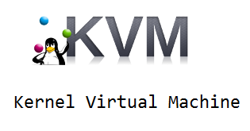
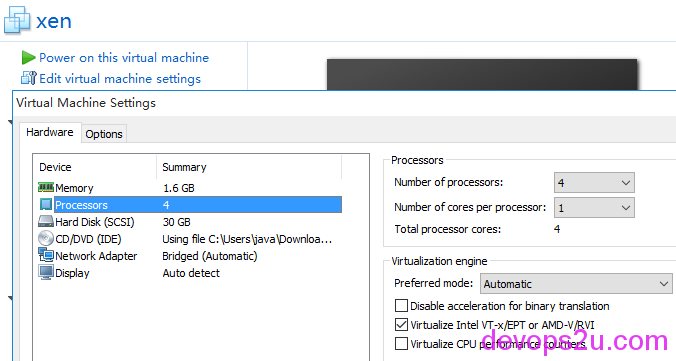
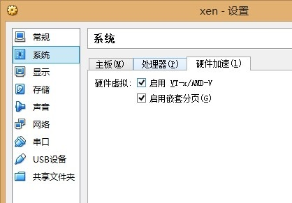

# 虚拟化之KVM配置应用

1. kvm说明
2. 开启虚拟化
3. 安装KVM
4. 配置安装虚拟机的源
5. 启动虚拟机guest 0
6. guest主机的配置
7. 虚拟机的克隆和快照

### kvm说明

虚拟化技术有多个分类，全虚拟化（VMware workstations、KVM、Xen（HVM））、半虚拟化（Xen）、OS级别虚拟化（openVZ、lxc）、应用程序虚拟化（jvm）、库虚拟化（wine）



网站：<http://www.linux-kvm.org/page/Main_Page>

KVM（基于内核的虚拟机）是Linux在包含虚拟化扩展（Intel VT或AMD-V）的x86硬件一个完整的虚拟化解决方案。它由一个可加载的内核模块 kvm.ko，提供了核心的虚拟化基础架构和处理器特定模块，还有kvm-intel.ko kvm-amd.ko模块。使用KVM，用户可以运行多个完整的Linux或Windows虚拟机。每个虚拟机都有私有虚拟化硬件：网卡，硬盘，图形适配器等。

先说一下几个名词：

QEMU是一个通用，开放源码、面向各个平台的模拟器或者说是仿真器。通过使用动态翻译，实现了非常好的性能。

libvirt是一套免费、开源的支持Linux下主流虚拟化工具的C函数库，其旨在为包括Xen在内的各种虚拟化工具提供一套方便、可靠的编程接口。libvirt *本身* 不是一种工具， 它是一种可以建立工具来管理客户操作系统的 API

virsh 管理VM的最简单的 shell

### **开启虚拟化**

一般主机都有在BIOS开启，VMware配置是在每个虚拟机面板的”Edit virtual machine settings”–“Processors”–“Virtualization engine”–“Virtualize Intel VT-x/EPT or AMD-V/RVI”  在前面框打钩即可



VirtualBox设置



下面演示系统为Centos 6.7 X86_64

关闭selinux  SELINUX=disabled

查看cpu是否支持虚拟化，vmx属于inter处理器,svm属于amd处理器
egrep ‘vmx|svm’ /proc/cpuinfo

### **安装KVM**

```
yum  groupinstall "Development Tools"
yum  groupinstall "Virtualization" "Virtualization Client" "Virtualization Platform"
```

virtualization //提供虚拟机的环境，主要包含qumu-kvm
virtualization-client//管理和安装虚拟机实例的客户端，主要有python-virtinst,virt-manager,virt-viewer
virtualization-platform//提供访问和控制虚拟客户端的接口，主要有libvirt，libvirt-client
安装完成后重启系统，重启系统后检查是否加载了kvm模块

```
# lsmod|grep kvm
kvm_intel              53484  12
kvm                   316506  1 kvm_intel
```

开启服务

```
# /etc/init.d/libvirtd start
# chkconfig libvirtd on
   
# virsh -c qemu:///system list  
 Id    Name                           State
 
# service libvirtd status 
libvirtd (pid  2944) is running...
  
# chkconfig --list libvirtd
libvirtd        0:off   1:off   2:off   3:on    4:on    5:on    6:off
```

配置网卡

设置本机的物理网卡为bridge，可以理解为物理网卡现在就是个网桥设备。如果是服务器，一般设置两个网卡（一内网 一外网），下面虚拟机就设置一个，两块网卡同理

```
# yum install bridge-utils.x86_64 acpid -y
 
# brctl show
bridge name    bridge id      STP enabled    interfaces
virbr0      8000.525400fe8dd9   yes     virbr0-nic
 
# cp /etc/sysconfig/network-scripts/ifcfg-em1 /etc/sysconfig/network-scripts/ifcfg-br0
 
# cat /etc/sysconfig/network-scripts/ifcfg-em1  #网卡为bridge模式，没有IP
DEVICE=em1
TYPE=Ethernet
UUID=****
ONBOOT=yes
NM_CONTROLLED=no
BOOTPROTO=static
BRIDGE=br0
DEFROUTE=yes
IPV4_FAILURE_FATAL=yes
IPV6INIT=no
NAME="System em1"
HWADDR=****
 
# cat /etc/sysconfig/network-scripts/ifcfg-br0 #type为Bridge，设置IP，注意大小写
DEVICE=br0
TYPE=Bridge
ONBOOT=yes
NM_CONTROLLED=no
BOOTPROTO=none
IPADDR=****
PREFIX=**
GATEWAY=****
DNS1=114.114.114.114
DOMAIN=114.114.114.114
DEFROUTE=yes
NAME="System br0"
 
# service network restart 
# service acpid start     #电源管理
```

查看网络连接

```
# brctl show 
bridge name bridge id        STP enabled    interfaces
br0         8000.74867af0c7a0   no          em1
virbr0      8000.525400cbfade   yes         virbr0-nic
```

开启IP转发

```
cat /etc/sysctl.conf |grep ip_forward
net.ipv4.ip_forward = 1
```

### **配置安装虚拟机的源**

因为阿里云、搜狐、网易的mirrors只保留最新版本的，现在也不会找到Centos6.6版本的系统了，所以自己存一份吧。装个http设置一下就好。这一步可以省略，直接用网上的源，只是受网速影响

```
# mkdir /mnt/cdrom
# mkdir /var/www/centos
# mount -o loop -t iso9660 /data/CentOS-6.7-x86_64-minimal.iso /mnt/cdrom
# cp -r /mnt/cdrom /var/www/centos
 
# vim /var/www/centos/cdrom/.treeinfo
[general]
version = 6.7
arch = x86_64
family = CentOS
packagedir = 
timestamp = 1438724250.79
discnum = 1
variant = 
totaldiscs = 1
 
[images-x86_64]
initrd = images/pxeboot/initrd.img
kernel = images/pxeboot/vmlinuz
 
[images-xen]
initrd = images/pxeboot/initrd.img
kernel = images/pxeboot/vmlinuz
 
[stage2]
mainimage = images/install.img
 
#x!强制保存
```

```
yum install httpd 
#只需要修改httpd.conf的292、318两行，welcome.conf 第8行
# vim +292 /etc/httpd/conf/httpd.conf
#DocumentRoot "/var/www/html"
DocumentRoot "/var/www/centos/cdrom"  
<Directory />
   Options indexes FollowSymLinks
   AllowOverride none
</Directory>
<Directory "/var/www/centos/cdrom">        
 
  
# vim /etc/httpd/conf.d/welcome.conf
 <LocationMatch "^/+$">
   Options +Indexes
   ErrorDocument 403 /error/noindex.html
</LocationMatch>
 
# service httpd start
#开启iptables80端口,这时访问IP就就是光盘的列表
```

### **启动虚拟机guest 0**

```
mkdir /var/kvm/
virt-install -v -n bbotte -r 512 --vcpus=4 --location=/var/www/centos --nographics --virt-type=kvm --disk path=/var/kvm/bbotte.img,size=10,sparse -w bridge:br0 --extra-args='console=tty0  console=ttyS0,115200n8' --connect qemu:///system
 
kvm名称：bbotte
内存：512M（如果宿主机内存小的话，guest就小点，要不会出错误提醒）
cpu：4颗
虚拟磁盘路径：/var/kvm/bbotte.img
磁盘大小：10G
 
用搜狐源安装方式：
virt-install -v -n bbotte -r 512 --vcpus=4 -l http://mirrors.sohu.com/centos/6.7/os/x86_64/  --nographics --virt-type=kvm --disk path=/var/kvm/bbotte.img,size=10,sparse -w bridge:br0 --extra-args='console=tty0 console=ttyS0,115200n8' --connect qemu:///system
```

下面就开始安装了:  

安装步骤参考[虚拟化之Xen配置应用](http://bbotte.com/kvm-xen/virtualization-of-xen-project-configuration-applications/)

1，选择语言
2，选择安装方式，用自己配置的http，所以选最下面的URL
3，为主机手动配置ip地址
4，输入安装的url，这里是http://ip，就是刚才http配置的系统源，Tab到ok即可
5，可以开启VNC安装系统，或者继续命令行
6，下面安装系统就不说了，时区，分区格式化，安装好重启完成

### **guest主机的配置**

```
# virsh edit bbotte  #设置虚拟机配置
 
#现在虚拟机只有一个网卡，比如要两块网卡，一内网，一个外网，那么要修改配置
复制一份网卡的配置，粘贴，并修改"mac address" 和 slot='0x06',不能和已有网卡重复
<interface type='bridge'>
      <mac address='****'/>
      <sourcebridge='br0'/>
      <modeltype='virtio'/>
      <address type='pci'domain='0x0000' bus='0x00' slot='0x06' function='0x0'/>
    </interface>
 
完事启动虚拟机，到里面复制一份网卡配置，修改ip即可
```

```
常用的命令：
virsh start bbotte     #启动
virsh console bbotte   #连接
virsh shutdown bbotte  #关机
virsh destroy bbotte   #断电，比如OOM、系统出问题，终端进不去
virsh undefine bbotte  #删除guest bbotte
virsh list               #查看正在运行的guest
virsh edit bbotte      #编辑guest的配置文件，可以调整cpu数量，内存大小，网卡
 
 
virsh有强大的命令行客户端
# virsh
Welcome to virsh, the virtualization interactive terminal.
 
Type:  'help' for help with commands
       'quit' to quit
 
virsh # help
Grouped commands:
```

怎样退出guest
1.exit #退出登陆
2.会弹出一个仍然让你登陆的页面，同时按 Ctrl+ ] 即可

### **虚拟机的克隆和快照**

克隆

virt-clone –connect qemu:///system –original=bbotte –name=copy_guest –file=/var/kvm/copy_guest.qcow2

做快照

上面创建虚拟机磁盘文件为img格式，做快照，或者扩容硬盘需要用qcow2格式，用qcow2格式玩玩

```
#创建虚拟机文件
qemu-img create -f qcow2  -o size=100G,preallocation=metadata /var/kvm/bbotte.qcow2
qemu-img info -f qcow2 /var/kvm/bbotte.qcow2
 
#两块网卡为下：
virt-install -v -n bbotte -r 4096 --vcpus=4 --location=/var/www/centos --nographics --virt-type=kvm --disk  path=/var/kvm/bbotte.qcow2,device=disk,format=qcow2,bus=virtio,cache=writeback,size=100 -w bridge:br0 -w bridge:br1 --extra-args='console=tty0 console=ttyS0,115200n8' --connect qemu:///system
 
kvm名称：bbotte
内存：4G
cpu：4颗
磁盘文件名称：bbotte.qcow2
虚拟磁盘路径：/var/kvm/bbotte.qcow2
磁盘大小：100G
```

安装完毕，查看安装的guest磁盘文件信息

```
# qemu-img info /var/kvm/bbotte.qcow2 
image: /var/kvm/bbotte.qcow2
file format: qcow2                       #磁盘格式
virtual size: 100G (101061273600 bytes)  #guest系统磁盘看到的是100G
disk size: 6G                            #实际占用磁盘空间6G
cluster_size: 65536
```

guest在启动的时候就可以做快照，不过要注意的是快照的时候是暂时的休克，ping不通外网的

```
# virsh list
 Id    Name                           State
----------------------------------------------------
 3    bbotte                        running
# virsh snapshot-create bbotte
Domain snapshot 1414228727 created
 
#快照已经生成，查看磁盘文件可知
# qemu-img info /var/kvm/bbotte.qcow2 
image: /var/kvm/bbotte.qcow2
file format: qcow2                  
virtual size: 100G (101061273600 bytes) 
disk size: 6G                            
cluster_size: 65536
Snapshot list:
ID        TAG                 VM SIZE                DATE       VM CLOCK
1         1414228756             786M     2015-10-25 17:18:47  677:36:07.930
```

查看qcow2的磁盘信息，多了Snapshot list
或者用这个命令查看快照
qemu-img snapshot -l /var/kvm/bbotte.qcow2
快照的配置文件默认在 /var/lib/libvirt/qemu/snapshot/bbotte/1414228756.xml

恢复快照

如果需要恢复快照，那么把guest停止，再恢复
virsh snapshot-revert bbotte 1414228756（快照的TAG）
完事需要把时间同步为准确的时间
ntpdate ntp1.aliyun.com ;hwclock -w

2016年03月22日 于 [linux工匠](http://www.bbotte.com/) 发表